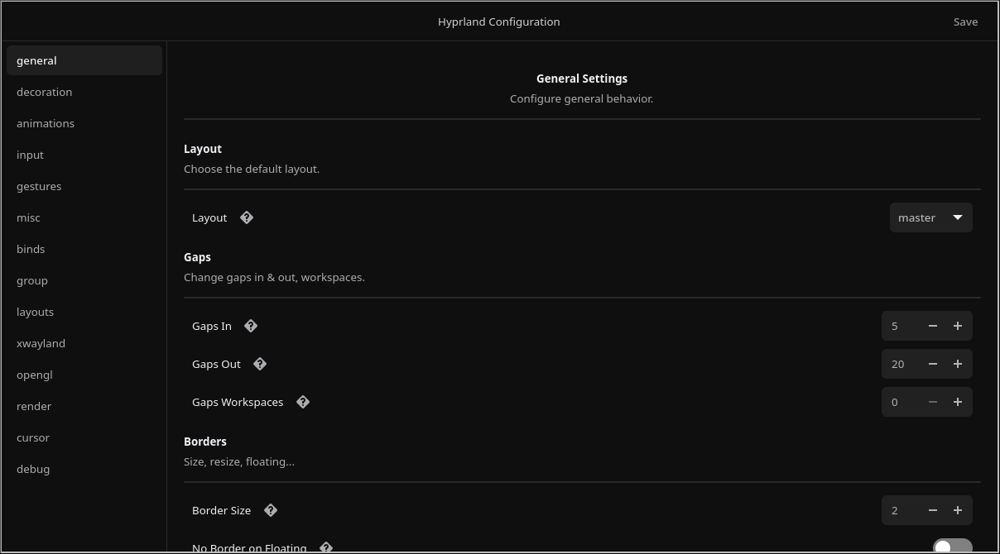

<div align='center'>

<h2>HyprGUI </h2>


An unofficial GUI for configuring Hyprland, built with GTK4 and Rust. 🚀🦀<br>
Comes with a custom [hyprparser](https://github.com/nnyyxxxx/hyprparser) for Hyprland's configuration file. (Rust btw) 🦀

## Preview


</div>

## Installation

### GitHub Releases
See HyprGUI's [releases page](https://github.com/nnyyxxxx/hyprgui/releases) for downloadable binaries.

### Arch Linux
There are 2 different [AUR](https://aur.archlinux.org) packages available:

- [hyprgui](https://aur.archlinux.org/packages/hyprgui) - Latest release built from source
- [hyprgui-bin](https://aur.archlinux.org/packages/hyprgui-bin) - Latest release in binary form

Install the preferred package with:
```bash
git clone https://aur.archlinux.org/<package>.git
cd <package>
makepkg -si
```

Or, if you're using an [AUR Helper](https://wiki.archlinux.org/title/AUR_helpers), it's even simpler (using [paru](https://github.com/Morganamilo/paru) as an example):
```bash
paru -S <package>
```

## Building from source
1. Install Rust (preferably `rustup`) through your distro's package or [the official script](https://www.rust-lang.org/tools/install)
2. Install `git`, `pango` and `gtk4`
3. Clone this repository:
`git clone https://github.com/nnyyxxxx/hyprgui && cd hyprgui`
4. Compile the app with `cargo build --release` or run it directly with `cargo run --release`

## TODO:
- [x] Implement GUI
- [x] Implement parser
- [x] Improve the readme
- [ ] Improve parser
- [ ] Improve GUI

## Credits:
- [Nyx](https://github.com/nnyyxxxx) - Implementing the parser, rest of the GUI, and maintaining the project
- [Adam](https://github.com/adamperkowski) - Implementing the base GUI, maintaining the AUR packages and the project alongside Nyx
- [Vaxry](https://github.com/vaxerski) - Hyprland
- [rust-gtk](https://github.com/gtk-rs/gtk4-rs) - The GTK4 library
- [Hyprland](https://github.com/hyprwm/Hyprland) - The window manager

<h6 align='center'>Copyright (C) 2024 HyprUtils<h6>
